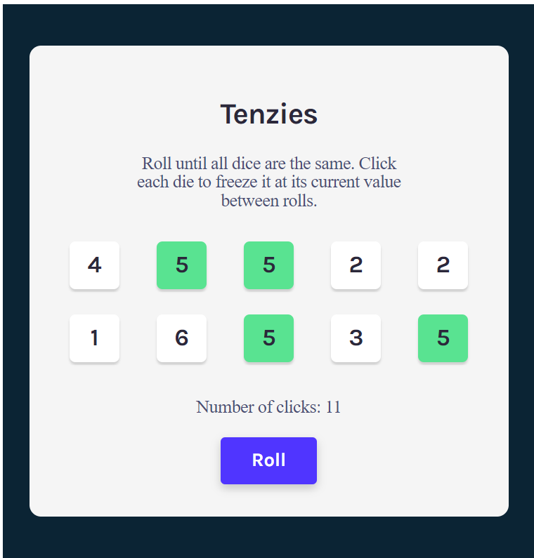
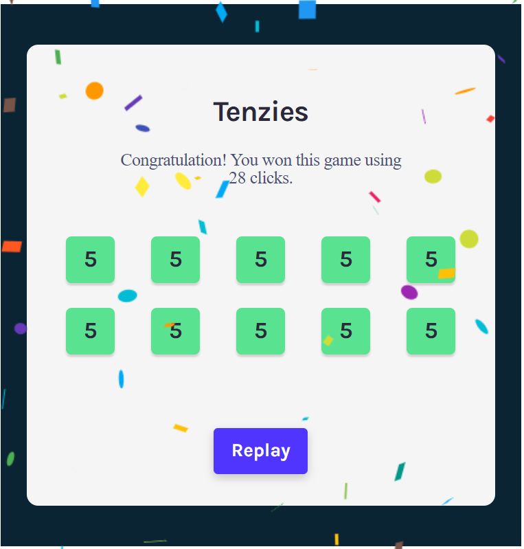

# Tenziees game with React

## Description
Game purpose: Roll until all dice are the same. Click each die to freeze it at its current value between rolls.

## Install dependencies
In order to clone the repo, open your terminal and type: 

    git clone https://github.com/salmakld/Tenzies-game.git

To install the required dependencies, cd into `Tenzies-game` folder and type:
    
    npm install    

In fact, the file `package.json` keeps track of all the different kinds of dependencies used in the project. Directly running a specific command for installing a dependency as an npm package process updates automatically the `package.json` file with the required details (dependency's name, version and type). 

## Run the project
To run the project in the development mode use: 

    npm start

Then open [http://localhost:3000](http://localhost:3000) to view it in the browser.
## Screenshot

